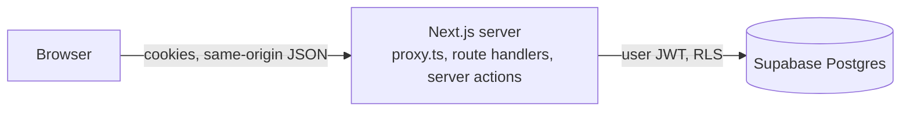

# Archive — private anime & game workspaces

A private, invite-only archive where every anime, game or custom entry is its
own workspace: a VS Code-style explorer of nested folders on the left, and an
editor for Markdown notes and checklists on the right. Everything is local,
user-owned data; there is no external catalog or sync.

- **Stack:** Next.js 16 (App Router, `src/proxy.ts`), strict TypeScript, Tailwind CSS 4, shadcn/ui (Radix), Lucide, TanStack Query, Zod, Supabase (Auth, Postgres), Vitest, Playwright.
- **Visual direction:** dark-first (`#0b0c0f`), charcoal surfaces, jade/coral accents, Manrope, radii ≤ 8px, glass only on overlays.

## Architecture



- Every vault page, route handler and server action verifies the session with `supabase.auth.getClaims()`; ownership always comes from the verified `sub`, never from client input. All data access uses the user's JWT, so RLS applies. The app never uses the Supabase secret key (only `npm run user:invite` and the tests do).
- A workspace is an `entries` row (`anime`, `game` or `custom`, with title, artwork and an optional platform) plus a tree of `workspace_nodes` (`folder`, `note` or `checklist`). Notes hold Markdown; checklists hold `workspace_checklist_items` with user-written labels and checked states.

```
src/app/(auth)             login, email-link confirmation, sign-out, session recovery
src/app/(vault)            library, entries/new, entries/[id] (workspace), settings
src/app/api                JSON route handlers (all authenticated)
src/components/workspace   explorer tree, note editor, checklist editor, move dialog, header
src/components             ui (shadcn), layout, media
src/lib/workspace          pure tree helpers (sorting, moves, names) shared by client and server
src/lib/validation         Zod schemas for entries and workspace input
src/lib/data               server-only loaders
src/lib/supabase           SSR clients, proxy session refresh, auth helpers, generated types
supabase/migrations        schema, RLS, RPCs, data migrations
supabase/tests             pgTAP RLS/integrity tests
tests/{unit,integration,e2e,support}
```

## The workspace

- **Explorer:** nested folders with chevrons, indentation and guide lines. Folders sort first, then names in natural order ("Episode 2" before "Episode 10"). Create, rename (inline, `F2`), move (drag and drop, or **Move to…**), and delete (with a confirmation that counts what is inside). Arrow keys move through the tree, `Enter` opens a file, `Delete` deletes it. Sibling names are unique regardless of case. Expanded folders are remembered per browser; the open file is kept in the URL (`?file=…`), so reloads return to it.
- **Notes:** Markdown with Write/Preview. Text autosaves shortly after you stop typing, when the editor loses focus, and on `Ctrl/⌘+S`. A status shows *Unsaved changes*, *Saving…*, *Saved* or *Not saved* (with **Retry**). Drafts are mirrored to `localStorage` until the server confirms them and are restored after a crash or failed save. A version check stops two tabs from silently overwriting each other: you choose **Keep my version** or **Load the other version**.
- **Checklists:** add one item or paste a list (one item per line), rename, reorder, delete, check/uncheck all. Changes apply immediately and are sent in order; a failed change is rolled back and reported.
- **Layout:** the artwork and title scroll away with the page; the workspace then fills the viewport. On desktop the explorer stays in view and can be hidden; on small screens it opens as a sheet from **Files**.
- **Creating entries:** **New → Anime / Game / Custom** asks for a title and optional artwork URLs (HTTPS, allow-listed hosts). New workspaces start with a few starter files (anime: *Notes*, *Arcs*; games: *Tier List*, *Codes*, *Guides*, *Checklist*) that can be renamed or deleted.

## Local setup

Requirements: Node 20.9+ (24 used), Docker.

```bash
npm install
npx supabase start                    # local Postgres/Auth (first run pulls images)
cp .env.example .env.local            # fill in from `npx supabase status`
npx supabase db reset                 # apply migrations (or `npx supabase migration up` to keep data)
npm run user:invite -- --email you@example.com --password   # invite-only; prompts for a password
npm run dev
```

### Environment variables

| Variable | Where | Purpose |
| --- | --- | --- |
| `NEXT_PUBLIC_SUPABASE_URL`, `NEXT_PUBLIC_SUPABASE_PUBLISHABLE_KEY` | app | Supabase project URL and publishable key |
| `APP_URL` | app | Public base URL (redirects, Origin checks) |
| `EXTRA_IMAGE_HOSTS` | app (optional) | Extra comma-separated HTTPS artwork hosts |
| `SUPABASE_SECRET_KEY` | scripts/tests only | `npm run user:invite` and integration/E2E tests |

## Database

Migrations (`supabase/migrations`, applied in order). Migrations 1–8 built the earlier catalog/MyAnimeList model; migration 9 converts it:

- `20260930000900_workspaces` creates `workspace_nodes` and `workspace_checklist_items` with composite `(user_id, …)` foreign keys (a parent must be a folder in the same workspace of the same owner), a trigger that rejects cycles and nesting deeper than 32 levels (per-workspace advisory lock), unique sibling names, a content `version` that only changes when note text changes, column-level grants (ids, owners, versions and timestamps are never client-writable), RLS, the invoker RPCs `add_checklist_items`, `reorder_checklist_items` and `set_checklist_checked`, and the security-invoker views `workspace_tree` and `entry_workspace_summary`.
- It then **migrates existing data** and only afterwards drops the old tables:

  | Before | After |
  | --- | --- |
  | `franchise` entries | `anime` entries (import metadata removed) |
  | Entry notes (the old Notes panel) | a **Notes** note at the workspace root |
  | Custom tabs | one note or checklist per tab, same order and content |
  | Custom checklist items | items in their tab's checklist (checked state kept) |
  | Works with episodes | folder `N. <title>` with an **Episodes** checklist (per-episode checks kept) |
  | Movies, OVAs, specials without episodes | items in **Movies** / **OVAs & Specials** / **Series** checklists (checked if completed) |
  | Arcs | **Arcs** checklist next to their work (checked when every member episode was) |
  | Status, score, per-work notes, watched counts not tied to episodes | a **Progress notes** note |
  | `game` platform | `entries.platform` |

- Removed: `media_items`, `entry_media_items`, `user_progress`, `custom_games`, `arcs`, `arc_items`, the Jikan catalog and cache tables, the `jobs` queue, all MyAnimeList tables (tokens, OAuth state, list mirror, baselines, outbox, conflicts), their functions and triggers, the pg_cron schedules, the worker's Vault secrets and the `worker` Edge Function. The `pg_cron`/`pg_net` extensions are left installed but unused.

Regenerate types with `npm run db:types`.

## Authentication

- Email + password and optional magic links via Supabase SSR cookies (`@supabase/ssr`, `getClaims()` in `src/proxy.ts` and every handler).
- Invite-only: `[auth] enable_signup = false`; magic links use `shouldCreateUser: false`. Accounts come from `npm run user:invite` (email invite or password). Profiles are created idempotently after verified sign-in.
- Email templates (`supabase/templates`) link to `/auth/confirm?token_hash=…` which verifies server-side.
- Hosted project: disable "Allow new users to sign up", set Site URL and redirect URLs to `APP_URL`, and paste the three templates into Auth → Email Templates.

## Commands

```bash
npm run dev               # Next.js dev server
npm run typecheck && npm run lint
npm test                  # unit tests
npm run test:db           # pgTAP RLS/integrity tests (local Supabase)
npm run test:integration  # RLS and workspace rules against local Supabase
npm run test:e2e          # Playwright journeys (desktop + mobile) on :3100
npm run build
```

`test:e2e` needs Playwright's Chromium (`npx playwright install chromium`) and its system libraries (`npx playwright install-deps`). Without root, the missing libraries can be extracted from `.deb` packages into a user directory and exposed with `LD_LIBRARY_PATH`. The E2E setup deletes and recreates the `e2e-*@test.local` users.
