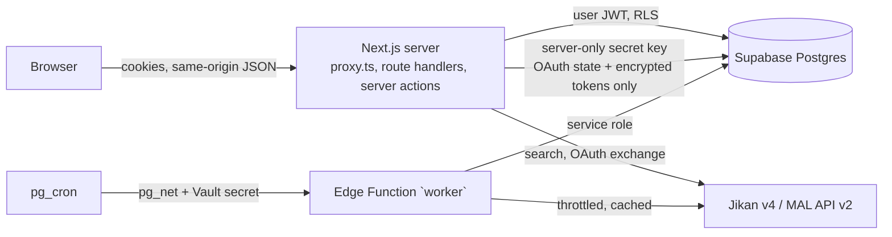

# Archive — private media archive with MyAnimeList sync

A private, invite-only dashboard for tracking anime franchises (imported from
MyAnimeList metadata), games and custom entries, with episode/movie/checklist
progress and optional two-way synchronization with a MyAnimeList list.

- **Stack:** Next.js 16 (App Router, `src/proxy.ts`), strict TypeScript, Tailwind CSS 4, shadcn/ui (Radix), Lucide, TanStack Query, Zod, Supabase (Auth, Postgres, Edge Functions, pg_cron, Vault), Vitest, Playwright.
- **Visual direction:** dark-first (`#0b0c0f`), charcoal surfaces, jade/coral accents, Manrope, radii ≤ 8px, glass only on overlays (mobile tab bar). reanime.to was consulted for direction only; its page could be fetched as text but its visual design could not be inspected, so the UI follows the written spec. No branding, code or assets were copied.

## Architecture



- Every vault page, route handler and server action verifies the session with `supabase.auth.getClaims()`; ownership always comes from the verified `sub`, never from client input. User data access uses the user's JWT, so RLS applies.
- The only server-side use of the Supabase secret key is `src/lib/sync/connection.server.ts` (OAuth state and encrypted MAL tokens, which authenticated users cannot read at all).
- Durable work (franchise imports, MAL list pulls, the MAL outbox) is stored in Postgres and executed by one worker implementation (`src/lib/worker/run.ts`). It runs in the `supabase/functions/worker` Edge Function (scheduled by pg_cron) and can also be run locally with Node (`npm run worker`).
- Code shared with the Deno worker (`src/lib/{providers,imports,sync,worker}`) uses relative `.ts` imports and only `zod` / type-only Supabase imports (mapped in `supabase/functions/worker/deno.json`).

```
src/app/(auth)        login, email-link confirmation, sign-out, session recovery
src/app/(vault)       dashboard, franchise/[id], entries/*, import, sync, settings
src/app/api           JSON route handlers (all authenticated)
src/components        ui (shadcn), layout, media, franchise, sync
src/lib/supabase      SSR clients, proxy session refresh, auth helpers, generated types
src/lib/providers     Jikan + MAL clients, retry/Retry-After, cache, throttle
src/lib/imports       resumable franchise import state machine
src/lib/sync          AES-GCM secrets, OAuth PKCE, reconciliation rules, token refresh
src/lib/worker        job/outbox worker shared by Edge Function and Node
src/lib/progress      pure progress derivation (optimistic UI + tests)
supabase/migrations   schema, RLS, RPCs, cron schedule
supabase/functions    Edge Function entrypoint
supabase/tests        pgTAP RLS/integrity tests
tests/{unit,integration,e2e,support}
```

## Local setup

Requirements: Node 20.9+ (24 used), Docker.

```bash
npm install
npx supabase start                    # local Postgres/Auth/Edge runtime (first run pulls images)

# 1. Worker/Edge secrets (gitignored). Use fresh random values.
cat > supabase/.env <<EOF
WORKER_SECRET=$(openssl rand -hex 32)
TOKEN_ENCRYPTION_KEY=$(openssl rand -base64 32)
MAL_CLIENT_ID=
MAL_CLIENT_SECRET=
EOF

# 2. App env: copy .env.example to .env.local and fill it from `npx supabase status`
#    (publishable + secret key) and the SAME WORKER_SECRET / TOKEN_ENCRYPTION_KEY as above.
cp .env.example .env.local

npx supabase db reset                 # apply migrations
npx supabase stop && npx supabase start   # reload edge-runtime secrets after editing supabase/.env

npm run user:invite -- --email you@example.com --password   # invite-only; prompts for a password
npm run dev
```

Run work in the background with **one** of:

- `npm run worker` — Node poller using the same worker code (good for development).
- `npm run worker:schedule:local` — stores the worker URL/secret in local Vault so pg_cron calls the Edge Function every minute when work is due (the app also "pokes" `WORKER_URL` after enqueueing).

### Environment variables

| Variable | Where | Purpose |
| --- | --- | --- |
| `NEXT_PUBLIC_SUPABASE_URL`, `NEXT_PUBLIC_SUPABASE_PUBLISHABLE_KEY` | app | Supabase project URL and publishable key |
| `APP_URL` | app | Public base URL (redirects, Origin checks) |
| `SUPABASE_SECRET_KEY` | app (server only) | OAuth state/token storage and admin scripts only |
| `TOKEN_ENCRYPTION_KEY` | app + worker | base64 32-byte AES-256-GCM key for MAL tokens and PKCE verifiers |
| `WORKER_SECRET` | app + worker + Vault | Bearer secret for invoking the worker |
| `WORKER_URL` | app (optional) | Edge Function URL to poke after enqueueing |
| `MAL_CLIENT_ID`, `MAL_CLIENT_SECRET`, `MAL_REDIRECT_URI` | app (+ worker for id/secret) | Official MAL OAuth client |
| `JIKAN_BASE_URL`, `EXTRA_IMAGE_HOSTS` | optional | Provider override (tests); extra HTTPS artwork hosts |
| `MAL_AUTHORIZE_URL`, `MAL_TOKEN_URL`, `MAL_API_BASE_URL` | tests only | Point OAuth/API at the local mock |

Service-role keys and MAL tokens are never exposed to the browser; nothing secret is prefixed `NEXT_PUBLIC_`.

## Database

Migrations (`supabase/migrations`, applied in order):

1. `core_schema` — `users` (profiles only; identities live in `auth.users`), `entries`, `media_items`, `entry_media_items`, `user_progress`, `custom_games`, `arcs`, `arc_items`. Composite `(user_id, id)` keys and composite foreign keys make cross-owner references impossible. Triggers reject self-parenting, hierarchy cycles (per-owner advisory lock) and invalid parent kinds; `user_progress` enforces "atomic items use `is_checked`, works use aggregate `episodes_watched`"; custom tabs are validated by a CHECK function.
2. `catalog_and_jobs` — shared public catalog (`catalog_anime/relations/characters`, read-only for users), server-only `provider_cache` and `provider_throttle`, durable `jobs` (users may only insert `kind/input/dedupe_key` and cancel; one active job per key).
3. `mal_sync` — server-only `mal_credentials` and `oauth_states`; owner-readable `mal_accounts`, `mal_list_entries`, `sync_baselines`, `sync_outbox`, `sync_conflicts`; outbox enqueue trigger.
4. `functions` — invoker RPCs (`set_items_checked`, `set_container_progress`, `map_watched_count_to_episodes`, `create_arc`, `set_arc_checked`, `save_custom_tabs`, …), security-invoker read views, worker-only functions, and two scoped `SECURITY DEFINER` user actions (`approve_initial_sync`, `resolve_sync_conflict`).
5. `worker_schedule` — pg_cron jobs: wake the worker each minute when work is due; enqueue MAL refreshes every 6 h.
6. `read_helpers`, 7. `progress_locking` (per-work advisory lock so concurrent toggles cannot store stale aggregates), 8. `worker_schedule_toggle`.

Bulk checks, derived aggregates and outbox rows are written in one transaction. Regenerate types with `npm run db:types`.

## Authentication

- Email + password and optional magic links via Supabase SSR cookies (`@supabase/ssr`, `getClaims()` in `src/proxy.ts` and every handler).
- Invite-only: `[auth] enable_signup = false`; magic links use `shouldCreateUser: false`. Accounts come from `npm run user:invite` (email invite or password). Profiles are created idempotently after verified sign-in.
- Email templates (`supabase/templates`) link to `/auth/confirm?token_hash=…` which verifies server-side.
- Hosted project: disable "Allow new users to sign up", set Site URL and redirect URLs to `APP_URL`, and paste the three templates into Auth → Email Templates.

## MyAnimeList

Register an API client at <https://myanimelist.net/apiconfig> (App Type **web**), App Redirect URL = `${APP_URL}/api/mal/callback`, then set `MAL_CLIENT_ID`, `MAL_CLIENT_SECRET`, `MAL_REDIRECT_URI` in the app and `MAL_CLIENT_ID`/`MAL_CLIENT_SECRET` as worker secrets.

- Jikan v4 supplies public metadata (search, relations, episodes, characters). It cannot authenticate users or change lists.
- "Connect MyAnimeList" is separate from signing in. It uses the official authorization-code flow with PKCE `plain` (the only method MAL documents). State is SHA-256 hashed, bound to the user, expires in 10 minutes and is consumed atomically once. The code is exchanged server-side; tokens are AES-256-GCM encrypted with purpose/user-bound associated data.
- After connecting, the complete paginated list is pulled and shown on **/sync** for review. Nothing is written to MAL until you approve and explicitly enable outbound writes. Differing titles require a per-title choice.
- MAL stores watched **counts**, not which episodes. Counts are stored as aggregates; checking "episodes 1–N" requires an explicit confirmation on the franchise page.
- Outbound changes go through a durable, debounced (15 s) outbox, serialized per title. Before each write the worker re-reads the MAL entry and compares it with the stored baseline; if both sides changed, a conflict is recorded instead of overwriting. MAL list entries are never deleted.
- Expired access tokens are refreshed automatically. If refresh fails the account shows "Reconnect required"; local progress keeps working and queued changes are sent after reconnecting. Disconnect deletes tokens, pending OAuth state, cached list and baselines, and cancels pending pushes.

## Worker scheduling (hosted)

```bash
supabase functions deploy worker            # verify_jwt=false is set in config.toml
supabase secrets set WORKER_SECRET=… TOKEN_ENCRYPTION_KEY=… MAL_CLIENT_ID=… MAL_CLIENT_SECRET=…
```

Then in the SQL editor (values are read at run time by `public.invoke_worker()`):

```sql
select vault.create_secret('https://<project-ref>.supabase.co/functions/v1/worker', 'archive_worker_url');
select vault.create_secret('<WORKER_SECRET>', 'archive_worker_secret');
```

Imports use one Jikan request per step, a shared database throttle (~1.1 s spacing, under Jikan's 3/s and 60/min), a response cache with TTLs, bounded retries, and honour `Retry-After`: short waits are slept inline, long ones reschedule the job from its last checkpoint.

## Known metadata limitations

- Provider relations can be incomplete or inconsistent; imports report coverage and warnings and never invent works, episodes or characters. Add missing works from a franchise page ("Add work") or from the linked candidates list.
- Arc boundaries are not published by MyAnimeList: arcs are curated by episode range.
- Airing shows often have unknown totals; they stay shown as `x/?`.
- Crossovers, spin-offs and alternate versions are recorded as linked candidates and are not imported recursively. Music videos/CMs/PVs are skipped.
- Jikan returns 5xx when MyAnimeList refuses its requests; such related works are listed as "unavailable" candidates, and "Refresh from provider" retries later.
- Characters are loaded for the root and up to three main series; traversal stops after 80 works.

## Commands

```bash
npm run dev               # Next.js dev server
npm run typecheck && npm run lint
npm test                  # unit tests (mocked providers)
npm run test:db           # pgTAP RLS/integrity tests (local Supabase)
npm run test:integration  # worker, RLS and MAL sync against local Supabase with mocked providers
npm run test:e2e          # Playwright journeys (desktop + mobile) on :3100 with a mock provider server on :4010
npm run build
```

`test:e2e` needs Playwright's Chromium (`npx playwright install chromium`) and its system libraries (`npx playwright install-deps`). Without root, the missing libraries can be extracted from `.deb` packages into a user directory and exposed with `LD_LIBRARY_PATH`. The integration and E2E suites pause the cron-driven worker while they run and resume it afterwards.
